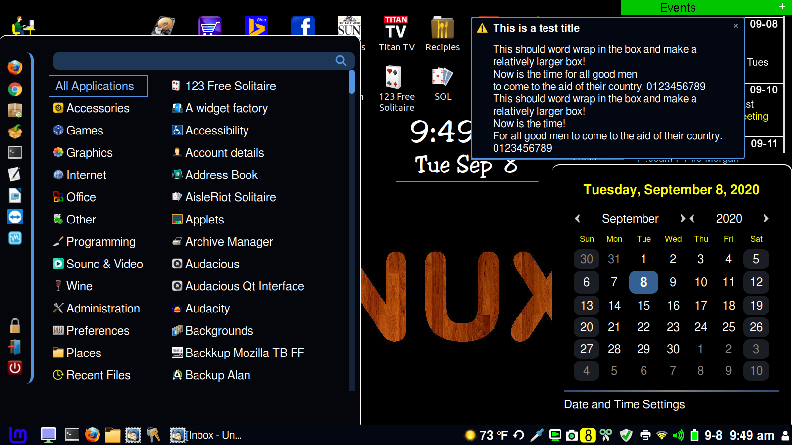

# CBlue2
A theme I have developed for Linux Mint Cinnamon with a larger font size for older eyes.  A darker background and no transparency.
I've stuggled with vision issues this past few years and purchased a new laptop in 2019 that took my 8 yr old laptop from 1366x768 to 1920x1080.  I changed it to 1600x900 as a compromise as fonts were extremely small for me, especially in Windows 10.  I added Linux Mint 19.3 Cinnamon as a second OS and made it the primary boot option.
I've been working on this theme over the past years under Mint 14 thru 20 constantly adjusting fonts and colors to improve readability.

Disclaimer:
I have only tested this on Linux Mint Cinnamon 19 & 20.   I have not used Ubuntu or other flavors of Linux.  There will or could logically be issues with caja, gedit or other programs that are not standard in Mint Cinnamon.  Also I have a limited use of my system.  I don't use workspaces so that too may not look as good with this theme as it could.  I use a panel on the bottom with applets and desklets and the standard default menu.

Thanks to bundy01 at https://cinnamon-spices.linuxmint.com/themes/view/CBlue
I liked the theme and modified it for the larger fonts, some colors and removed transparency.

Note: I also have a 2 Icon Theme repositories that you may want to download.

INSTALLATION:
Copy the CBlue2 folder into ~/.themes folder for personal use.
Copy to /usr/share/themes for global use.
Use Settings->Themes to select the appropriate theme for desktop, controls and borders.
Right click on the menu button in the panel, select 'configure' and edit the text box (should be blank), and set the menu icon to the blank.png included with CBlue2 theme.
CBlue2 theme has an icon for the start menu built in.

